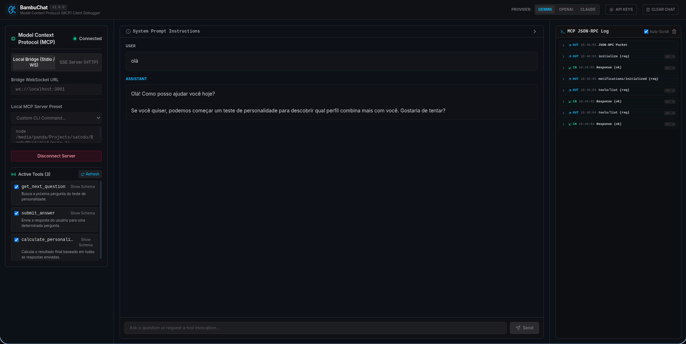
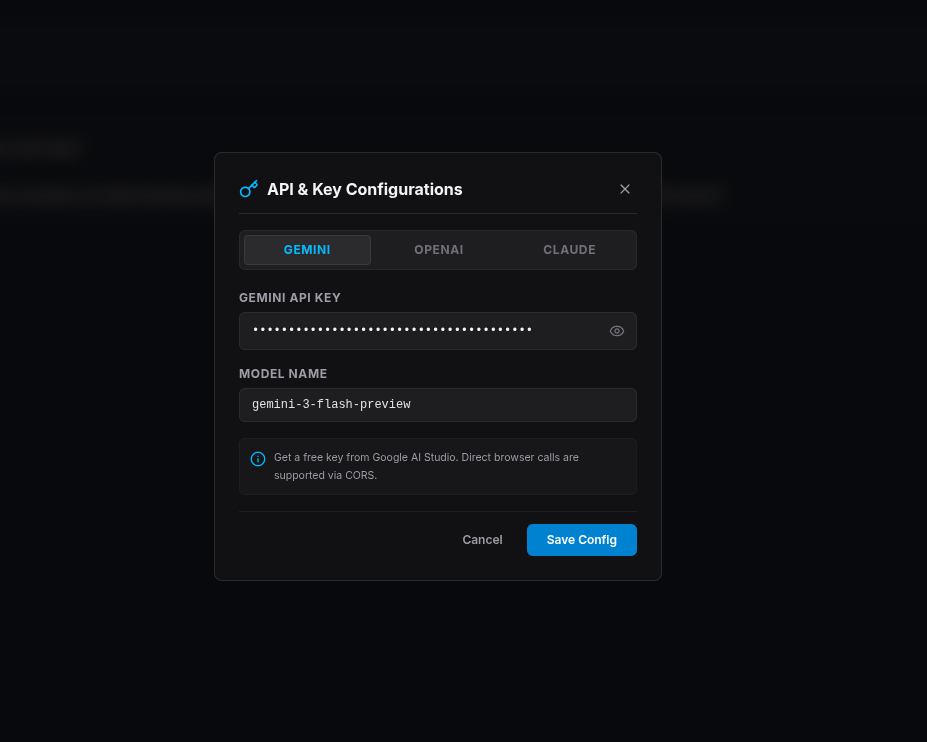
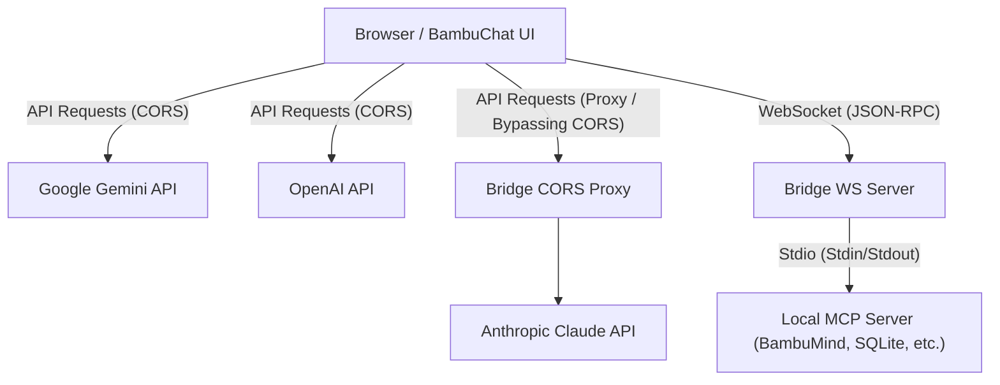

# BambuChat 🎋

BambuChat is a lightweight, zero-login, client-side chat interface designed for developers to interact with LLM providers (**Google Gemini, OpenAI, Anthropic Claude**) and test **Model Context Protocol (MCP)** servers locally or over remote endpoints.

It is designed to be fully static, allowing it to be compiled and hosted completely free of charge on **GitHub Pages** (via the included GitHub Actions workflow).

---

## Screenshots

### Main Dashboard Interface


### API Configurations Modal


---

## Key Features

- **Multi-Provider Support**: Enter your own API keys for Gemini, OpenAI, and Claude directly in the UI. Keys are stored safely in your browser's `localStorage` and never sent to a backend.
- **MCP Client Integrations**:
  - **SSE Transport**: Connect directly to remote or local MCP servers running over HTTP/SSE.
  - **Stdio Transport**: Connect to standard command-line MCP servers (Node, Python, Go, etc.) using the lightweight local WebSocket bridge.
- **Dynamic Bridge Spawning**: Switch between different local MCP commands directly from the browser UI without restarting the bridge terminal process.
- **MCP Telemetry Logs**: A live JSON-RPC request/response inspector to debug protocol exchanges in real-time.
- **Stateless Turn Handling**: Automatic preservation of Gemini's `thought_signature` tokens during tool-use loops, ensuring seamless reasoning chains.
- **Modern Shadcn-Inspired UI**: Premium dark mode design with glassmorphism, responsive controls, collapsible tool execution logs, and micro-animations built using **Tailwind CSS v4**.

---

## System Architecture



### 1. The Client-Side Frontend (React + Vite)
Handles the conversation logic, manages API keys, maps tool declarations, and renders chat bubbles and JSON-RPC logs.

### 2. The Local WebSocket Stdio Bridge (`mcp-bridge.js`)
Since browsers cannot execute terminal processes or read/write stdio streams due to security sandbox constraints, `mcp-bridge.js` acts as a lightweight proxy running on your computer. It:
1. Listens for WebSocket connections from the browser.
2. Dynamically spawns the configured MCP CLI command (e.g. `node /path/to/main.js`).
3. Pipes JSON-RPC messages between the WebSocket connection and the spawned process's `stdin`/`stdout`.
4. Serves as a CORS proxy (`/proxy` HTTP endpoint) to allow direct browser calls to Anthropic Claude (which normally restricts browser client-side origins).

---

## How to Get Started

### Prerequisites
- Node.js (v18+) installed on your machine.

### Local Installation & Development

1. **Clone the repository**:
   ```bash
   git clone https://github.com/your-username/BambuChat.git
   cd BambuChat
   ```

2. **Install dependencies**:
   ```bash
   npm install
   ```

3. **Start the Frontend development server**:
   ```bash
   npm run dev
   ```
   Open `http://localhost:5173/` in your browser.

---

## Testing Local Stdio MCP Servers (e.g. BambuMind)

To connect `BambuChat` to a local stdio MCP server, you must run the local bridge.

1. **Start the Bridge** (defaults to port `3001`):
   ```bash
   npm run bridge
   ```
   *Note: If you prefer a static, one-time command connection, you can also run it by explicitly passing the command: `npm run bridge -- --command "node /path/to/BambuMind/dist/main.js"`.*

2. **Open the Chat Application** (locally or via your hosted GitHub Pages URL).
3. **Configure API Keys**: Click the **API Keys ⚙️** button in the header, select your provider, input your API key, choose a model, and click **Save**.
4. **Configure MCP Server**:
   - Set connection type to **Local Bridge (Stdio / WS)**.
   - Enter your Bridge URL: `ws://localhost:3001`.
   - Under **Local MCP Server Preset**, choose **Custom CLI Command...** and type the launch command for your MCP server. Example:
     ```bash
     node /absolute/path/to/BambuMind/dist/main.js
     ```
   - Click **Connect Server**.
5. Once connected, active tools will appear in the sidebar. Start a conversation (e.g. *"Iniciar o teste de personalidade"*), and watch the model execute the tools in real-time!

---

## Connecting to Online Hosts (GitHub Pages)

Even when **BambuChat** is deployed and accessed online via `https://<username>.github.io/BambuChat/`, **it can still connect to your local MCP servers**. 

The JavaScript code runs locally inside your browser, meaning it can establish WebSocket connections directly to `ws://localhost:3001` on your machine. Modern browsers treat `localhost`/`127.0.0.1` as a secure exception, allowing `ws://` loopbacks from `https://` websites.

---

## Troubleshooting

### WebSocket Error 1006 / Connection Refused
- Ensure the bridge process is running (`npm run bridge`) and listening on the specified port.
- Check if another application is using port `3001`.
- Verify the CLI command typed in the UI is valid and runs successfully in your standard terminal. If the local MCP process crashes on boot, the bridge will immediately disconnect, triggering a WebSocket closure.

### Thought Signature Missing (Gemini 400 Bad Request)
- Newer Gemini models require the `thought_signature` token to verify chains of thought in function-calling loops. BambuChat handles this automatically by retaining the raw parts response structure. If you experience errors, ensure you are utilizing the updated chat layout and that your API keys are correctly validated.
